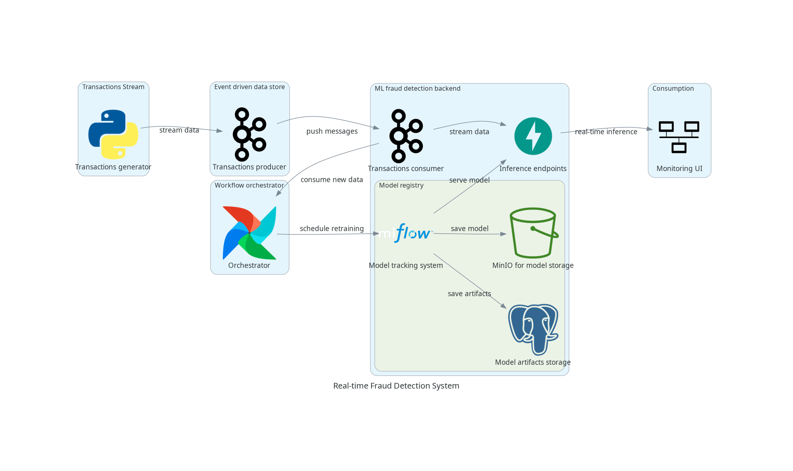
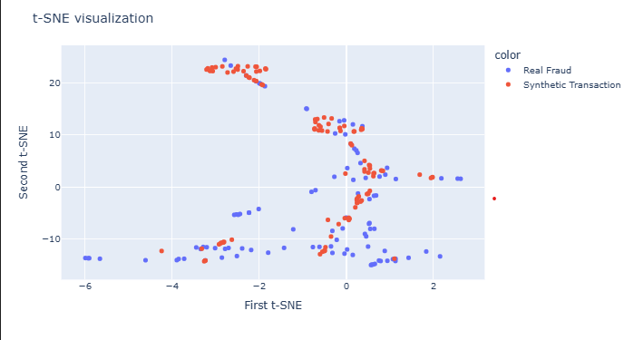
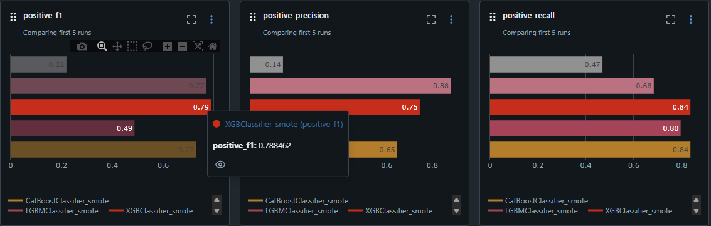
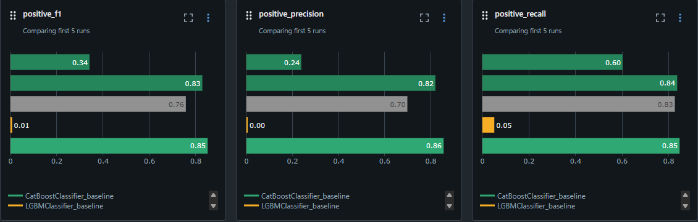
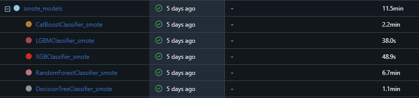
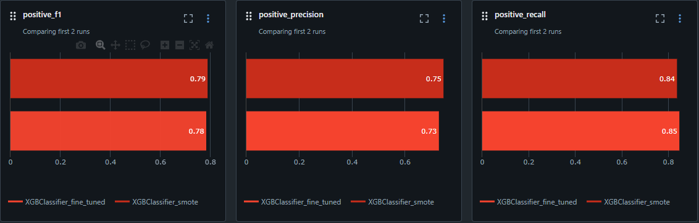
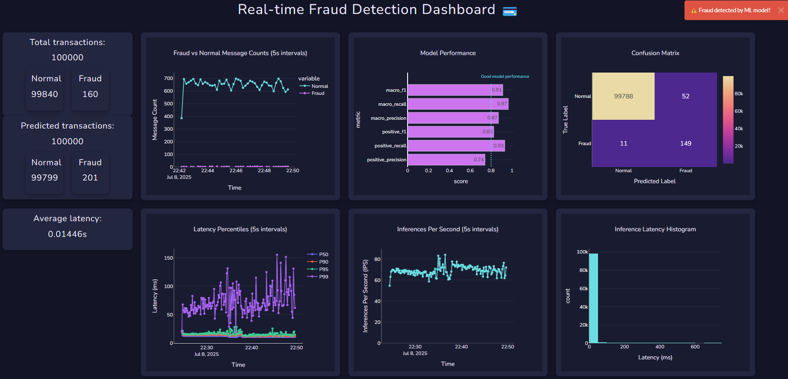

# 🕵️ Realtime Fraud Detection Pipeline

## 🚀 Project Overview

This project implements a **real-time fraud detection pipeline** using a Kafka-based streaming setup, GAN-based synthetic data generation, and ML model training and deployment, all containerized with Docker.

---

## 🛠️ Tech Stack

- **Kafka**: Real-time transaction data simulation via producer/consumer pattern.
- **Python**:
  - Synthetic data generation using `Conditional WGAN-GP`
  - FastAPI for serving models via REST API
  - Plotly Dash for UI and model monitoring
  - ML classifiers: baseline `DecisionTree` ➔ `Bagging (RandomForest)` ➔ `Boosting (XGBoost, CatBoost, LightGBM)`
- **MLFlow**: Model logging and performance monitoring.
- **MinIO**: S3-compatible storage for MLFlow artifacts (models, environments, etc.).
- **PostgreSQL**: Backend for MLflow metadata.
- **Docker**: Easy environment setup and deployment.
- **Airflow** *(To-do)*: Automated model retraining pipeline.

---

## 🧪 Dataset Setup

- Original dataset taken from Kaggle famous credit card transactions dataset: [Credit Card Fraud Detection](https://www.kaggle.com/datasets/mlg-ulb/creditcardfraud) with total **284,807 transactions**, 492 of which are frauds (about **0.172%**)
- The dataset is split into: `train`, `validation`, `test` (60%/20%/20%).
- **Classifier**: Trained on `train` set, evaluated on `test` set.
- **Synthesizer**: Trained only on the `validation` set (to avoid data leakage).

---

## 🧬 Synthetic Data Generation Insights

### ❗ Issues with SMOTE:

- SMOTE preserves the feature space structure, aiding classifiers on imbalanced datasets.
- However, it introduces **overfitting**—especially in small datasets with minority fraud samples.

### ❗ Issues with WGAN-GP:

- WGAN-GP struggles on **small datasets** (overfits easily).
- Even with SMOTE-upsampled data, it generates synthetic samples that are **too easy to separate**, leading to unreliable classifiers.
- Recommended: **SMOTE with 10% more fraud data** (vs. full oversampling) to reduce overfit.

---

## 🔬 Experiments with Synthesizer

### **First Experiment**:  
**Two separate WGAN-GP models** for normal and fraud data:

- Trained on:  
  - All data  
  - Only validation data  

- ❌ Issue: Classifier achieved **perfect metrics (100%)**, indicating:
  - **Data leakage** when training on all data.
  - Synthetic data is **too clean/separable**.
  - Models produce **non-overlapping distributions** for each class.

### **Second Experiment**:  
**Conditional WGAN-GP** for both classes:

- Trained only on **validation set**
- Observations:
  - SMOTE with large fraud ratio → **skewed distribution**
  - SMOTE with **10% fraud** seems more reasonable → but encounter **distribution drift**

### **Third/Last Experiment**:
**WGAN-GP** for only fraud transactions:

- Trained only on **validation set**
- Observations:
  - SMOTE with **10% fraud** seems more reasonable -> data looks reasonable on TSNE plot.

-> Generates a synthetic dataset composed of normal transactions from the validation set, along with 0.1–0.2% fraudulent transactions — 60% of which are synthesized, and the remaining 40% sourced directly from the validation set.

---

## 🧠 Classifier Development

- Tree-based classifiers were chosen due to:
  - Interpretability
  - Handling of mixed feature types
  - Good performance on tabular data with class imbalance

### Models Used:

| Model               | Notes |
|--------------------|-------|
| `DecisionTree`     | Baseline – underperformed |
| `RandomForest`     | Bagging approach – slower training, decent performance |
| `XGBoost` / `CatBoost` / `LightGBM` | Boosting models – fast, regularized, auto feature selection |

### Results:
- Models that uses SMOTE to upsample fraud transactions and trained on performs better for the positive class than non-SMOTE:

- SMOTE:

- Non-SMOTE:

- **XGBoost** achieved the highest F1 score of approximately 0.79 on the positive class. And also, the training time is relatively quick, comparing to the others -> and therefore **XGBoost** was selected for fine-tuning:

- Final model fine-tuned results:

-> Fine tuning doesn't improve much model performance, however it will be used as the final model.

### ✅ Test Run Summary

**100,000 transactions** streamed to the Kafka server.

- **Positive F1 Score: ~ 0.83** → Model performs well on real-time streaming data.
- **Positive Precision: ~ 0.74** Relatively low , which is expected as the model is designed to be conservative with fraud predictions.
- **Confusion Matrix:** Indicates good overall classification performance.
- **Latencies:**  
  - p50: 12.9 ms  
  - p90: 14.8 ms  
  - p95: 18.4 ms  
  - p99: 60 ms  
- **Throughput:**  
  - Average: **65 inferences/sec**  
  - Average Latency: **14.46 ms**